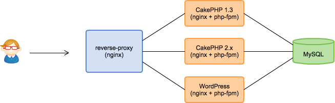

## 創成期

2010年3月　ひっそりと産声をあげる

- 非エンジニアである弊社代表が一人で WordPress をレンタルサーバに設置しサイトを開設
- 適当な無料の WordPress テーマ

---

## この頃のシステム構成

- レンタルサーバ 2500円/月
    - PHP(CGIモード)
- WordPress + いくつかのプラグイン 
- non programing


---

## ブログ期


---

## ブログ期

- ユーザが求めているであろう情報を投稿していった。
- 次第にユーザが増えてきた
- デザインをととのえる

---

## 2010年8月ぐらいまで

- エンジニア 0.2名 / 他でフルタイム勤務
- デザイナー 0.5名 / 岐阜県からリモート

---

## 2010年9月　会員制立ち上げ期

- 開発期間1ヶ月
- メインプログラマは、昨日までデザイナー
- セキュリティ怖い
- ユーザ管理/認証まわりは、WordPress のユーザ管理機構にのっかることに

---

## 手法

- WordPress 固定ページを作成し、各ページにテンプレートファイルを関連付け
- テンプレートファイルに、ベタりとPHPで記述
    - (例) mypage.php
- 使いまわす関数は function.php に

---

## レンタルサーバ プラン変更

- 会員登録機能/ログインのため、独自SSL が必要に
- 2500円/月 -> 4500円/月

---

## なんとか完成し、リリース！

- 順調に登録されているのをみてほっと胸をなでおろす
- マイページがあるだけで会員向けの機能など何一つなかった
- これまでのリピーターからの期待は高かった！
- 会員登録が日々増えていく
- ユーザからの期待は高い
- 使ってもらえる何かをはやく提供しなければ

---

## この頃の開発環境

- 開発環境: レンタルサーバ上に staging 環境
    - http://xxx.xxx.jp/staging/
- デプロイ: SCP でファイルアップロード
- テスト: 目視で動作かくにん！よかった
- ソースコード管理: (お察しください)
- 社内コミュニケーション: Yammer
- 最低限データの日次バックアップだけはとっていた

---

## 方針

サービスが当たるかどうかもわからない。

- アプリケーション
    - 動作する機能をとにかく実装、リリースしていく
- インフラ
    - 管理対象を必要最低限に保ち、極力増やさない
    - 最悪を避ける

---

# ユーザを集め、順調にPVが増え、レンタルサーバではパフォーマンスが低下してきた

---

## 2011年1月　共有レンタルサーバからVPS へ移行

- VPS (メモリ512G) へ移行
- nginx + php-fpm

---

# WordPress には詳しくなったが...

---

# WordPress のカスタマイズを続けることに限界を感じ始める

---

# デザインとロジックが分離されていない

---

# MVCフレームワークを使いたい

---

## 2011年3月

- まずは、社内向けの管理画面で CakePHP を試験導入してみる
- いくつかの機能を実装してみて、感触をつかむ

---

## 2011年6月　サービス側にも CakePHP を導入

- ただ、これまでに WordPress のカスタマイズで実装したページをすべて書き直している時間などない
- これまで開発したコードベースについてはそのまま活かす
- 今後新たに開発する機能やページについては、CakePHP で実装する
- この頃は v1.3

---

## フロントに nginx でリバースプロキシ


---

## nginx の設定

```
upstream wordpress {
    server 127.0.0.1:8001;
}

upstream cakephp {
    server 127.0.0.1:8002;
}
```

```
server {
    listen 80;
    server_name example.com;

    location ~ ^/legacy {
        proxy_pass http://wordpress;
        break;
    }

    location ~ ^/new/page {
        proxy_pass http://cakephp;
        break;
    }
}
```

---

## ほか直面した問題
- セッションの共有
- ログイン
- 共通する静的ファイル
- 共通箇所: ヘッダーやフッターなど

---

## このように解決

- セッションの共有
    - 同じサーバであったので php が吸収 
- ログイン
    - CakePHP から WordPress の Cookie をチェック
- 共通する静的ファイル
    - cakePHP の方を参照するように

---

# フレームワークのメジャーバージョンアップグレード

---

## 背景

- 2011年10月　CakePHP2 がリリースされた
- 2011/10 〜 2012.2　1.x で実装されたアプリケーションをメンテし続ける日々
- 機能要求、バクfix もたんまり
- CakePHP1 で開発した機能をすべて CakePHP2 で書き直している時間などない

---

# これどっかで見たやつや

---

## リバースプロキシに CakePHP2 をぶらさげる



---

## nginx の設定

```
upstream wordpress {
    server 127.0.0.1:8001;
}

upstream cakephp1 {
    server 127.0.0.1:8002;
}

upstream cakephp2 {
    server 127.0.0.1:8003;
}
```

```
server {
    listen 80;
    server_name example.com;

    location ~ ^/legacy {
        proxy_pass http://wordpress;
        break;
    }

    location ~ ^/bar/page {
        proxy_pass http://cakephp1;
        break;
    }

    location ~ ^/foo/page {
        proxy_pass http://cakephp2;
        break;
    }
}
```

---

## 方針

- 新機能は、CakePHP 2.x で
- 機能拡張は、CakePHP 2.x へ移行して実装
- ちょっとした修正は、CakePHP 1.x でメンテナンス

---

## 2012年1月
- 学生インターンが増え始める　2〜4名
- ようやくソースコード管理に Git を使うように
- 開発環境: 一人1つ VPS, サブドメイン + バーチャルホストで複数のアプリ

---

## 2013年夏
- 学生インターンがまた増える　一気に7名に
- 開発環境をVPSにいちいちセットアップし、サポートするのが面倒

---

## 開発環境それまで

- 手順書 + VPS (メモリ1G) にサーバ構築
- 半日かかっていた

---

## VPS を一人1つ借りていたのは

- Windows + XAMPP を使っているものもいたが
- Windows だと何かと環境の違いで本番に適用したら動かないなんてことがありがち

---

# Vagrant + chef


---

## これだけで開発環境が立ち上がる

```
❯ cd /path/to/dir
❯ git clone {repo-url}
❯ vagrant up
```

---

## よかった点

- 開発環境のセットアップが30分で完了
- 新メンバーが初日からコミットできるようになった！

---

## 問題点

- 4つのアプリがある
    - サービス、社内用コンテンツ管理画面、顧客向けの入稿管理画面、private API
- 4つの VM をローカルでたてる

---

# 紆余曲折あり...

- 2014.2〜2014.4　開発者が一気に増える
- 2名 -> 8名

---

## 積もってきた技術的負債
- スピード重視で開発してきたが、チームで開発するにはスピードが出なくなってきた

---

## まとめ (1)

- 機能リリース
   - 最初はとにかくユーザを集めたり、 ビジネスを立ち上げることに注力する
   - とにかく動く機能を細かくリリースし、検証を繰り返す
   - YAGNI
       - 「これもあったらいい」は使われないかもしれない
       - 作りすぎても運用され続けないかもしれない。

---

## まとめ (2)

- 開発基盤
    - ビジネスであったりユーザがついてからエンジニアを増員し、環境を整えればよい
    - 時間もとれないリソースも割けないことが多い
    - いきなり「理想の環境」には変えられない
    - 一歩ずつ有るべき姿に向かってよくしていく

---

# ご清聴ありがとうございました

<small>次は弊社　秋山　より</small>
