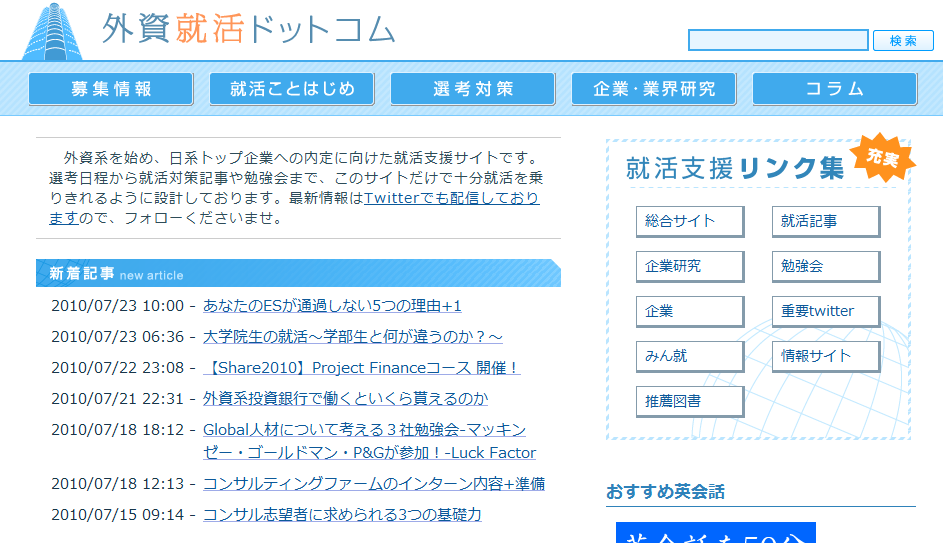

## 創成期

2010年3月　ひっそりと産声をあげる

- 非エンジニアである弊社代表が一人で WordPress をレンタルサーバに設置しサイトを開設
- 適当な無料の WordPress テーマ

---

## この頃のシステム構成

- レンタルサーバ 2500円/月
    - PHP(CGIモード)
- WordPress + いくつかのプラグイン 
- non programing

---

## ブログ期

---

## ブログ期

- ユーザが求めているであろう情報を投稿していった。
- 次第にユーザが増えてきた

---

## ちょっとデザインをととのえる

---

# 会員登録できるようにしよう

---

## 最初の壁 

エンジニアがいない!

---

## この頃

- エンジニア 0.2名 / 他でフルタイム勤務
- デザイナー 0.5名 / 岐阜県からリモート

---

## 2010年9月　会員制立ち上げ期

- 開発期間1ヶ月
- メインプログラマは、昨日まで Web デザイナー
- セキュリティ怖い
- ユーザ管理/認証まわりは、WordPress のユーザ管理機構にのっかることに

---

## 手法

- WordPress 固定ページを作成し、各ページにテンプレートファイルを関連付け
- テンプレートファイルに、ベタりとPHPで記述
    - (例) mypage.php
- 使いまわす関数は function.php に

---

## レンタルサーバ プラン変更

- 会員登録機能/ログインのため、独自SSL が必要に
- 2500円/月 -> 4500円/月

---

## なんとか完成し、リリース！

- 順調に登録されているのをみてほっと胸をなでおろす
- マイページがあるだけで会員向けの機能など何一つなかった
- これまでのリピーターからの期待は高かった！
- 会員登録が日々増えていく
- ユーザからの期待は高い
- 使ってもらえる何かをはやく提供しなければ

---

## この頃の開発環境

- 開発環境: レンタルサーバ上に staging 環境
    - http://xxx.xxx.jp/staging/
- デプロイ: SCP でファイルアップロード
- テスト: 目視で動作かくにん！よかった
- ソースコード管理: (お察しください)
- 社内コミュニケーション: Yammer
- DBの日次バックアップだけはとっていた

---

## 方針

サービスが当たるかどうかもわからない。

- アプリケーション
    - 動作する機能をとにかく実装、リリースしていく
- インフラ
    - 管理対象を必要最低限に保ち、極力増やさない
    - 最悪を避ける

---

# ユーザを集め、順調にPVが増え、レンタルサーバではパフォーマンスが低下してきた

---

## 2011年1月　共有レンタルサーバからVPS へ移行

- VPS (メモリ512G) へ移行
- nginx + php-fpm

---

# WordPress には詳しくなったが...

---

# WordPress のカスタマイズを続けることに限界を感じ始める

---

# デザインとロジックが分離されていない

---

# MVCフレームワークを使いたい

---

## 2011年3月

- まずは、社内向けの管理画面で CakePHP を試験導入してみる
- いくつかの機能を実装してみて、感触をつかむ

