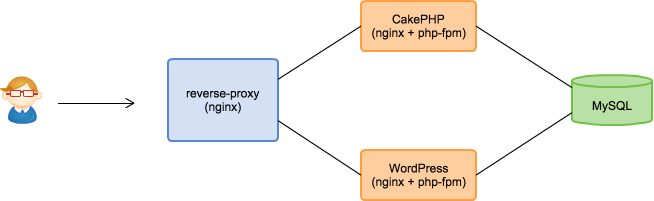

## 2011年6月　サービス側にも CakePHP を導入

- ただ、これまでに WordPress のカスタマイズで実装したページをすべて書き直している時間などない
- これまで開発したコードベースについてはそのまま活かす
- 今後新たに開発する機能やページについては、CakePHP で実装する
- この頃は v1.3

---

## フロントに nginx でリバースプロキシ



---

## nginx の設定

```
upstream wordpress {
    server 127.0.0.1:8001;
}

upstream cakephp {
    server 127.0.0.1:8002;
}
```

```
server {
    listen 80;
    server_name example.com;

    location ~ ^/legacy {
        proxy_pass http://wordpress;
        break;
    }

    location ~ ^/new/page {
        proxy_pass http://cakephp;
        break;
    }
}
```

---

## ほか直面した問題
- セッションの共有
- ログイン
- 共通する静的ファイル
- 共通箇所: ヘッダーやフッターなど

---

## このように解決

- セッションの共有
    - 同じサーバであったので php が吸収 
- ログイン
    - CakePHP から WordPress の Cookie をチェック
- 共通する静的ファイル
    - cakePHP の方 /img/hoge.png を参照するように

---

# フレームワークのメジャーバージョンアップグレード

---

## 背景

- 2011年10月　CakePHP2 がリリースされた
- 2011/10 〜 2012.2　1.x で実装されたアプリケーションをメンテし続ける日々
- 機能要求、バクfix もたんまり
- CakePHP1 で開発した機能をすべて CakePHP2 で書き直している時間などない

---

# これどっかで見たやつや

---

## リバースプロキシに CakePHP2 をぶらさげる


---

## nginx の設定

```
upstream wordpress {
    server 127.0.0.1:8001;
}

upstream cakephp1 {
    server 127.0.0.1:8002;
}

upstream cakephp2 {
    server 127.0.0.1:8003;
}
```

```
server {
    listen 80;
    server_name example.com;

    location ~ ^/legacy {
        proxy_pass http://wordpress;
        break;
    }

    location ~ ^/bar/page {
        proxy_pass http://cakephp1;
        break;
    }

    location ~ ^/foo/page {
        proxy_pass http://cakephp2;
        break;
    }
}
```

---

## 方針

- 新機能は、CakePHP 2.x で
<!-- .element: class="fragment" data-fragment-index="1" -->

- 機能拡張は、CakePHP 2.x へ移行して実装
<!-- .element: class="fragment" data-fragment-index="2" -->

- ちょっとした修正は、CakePHP 1.x でメンテナンス
<!-- .element: class="fragment" data-fragment-index="3" -->

---

## 課題

- header や footer 等、共通部分
<!-- .element: class="fragment" data-fragment-index="1" -->

    - WordPress, CakePHP1, CakePHP2 それぞれに同じ記述
<!-- .element: class="fragment" data-fragment-index="2" -->

    - 後に、外部ファイル化され、include
<!-- .element: class="fragment" data-fragment-index="3" -->

- このパスは、1.x / 2.x のどっちだったか・・
<!-- .element: class="fragment" data-fragment-index="4" -->

    - その都度、nginx の設定ファイルをみて確認
<!-- .element: class="fragment" data-fragment-index="5" -->

- 同じモデルを 1.x / 2.x の両方に書くことがある
<!-- .element: class="fragment" data-fragment-index="6" -->

- これでいいと思ってしまい、いつまでも 2.x へ完全移行されない
<!-- .element: class="fragment" data-fragment-index="7" -->

---

# 学生インターンがくるようになってきた

---

## この頃の開発環境

- 一人1つ VPS
- サブドメイン + バーチャルホストで複数のアプリ

---

## 開発環境の構築

- 新人向け手順書 + VPS (メモリ1G) にサーバ構築
- 申し込むところから
- 半日かかっていた
